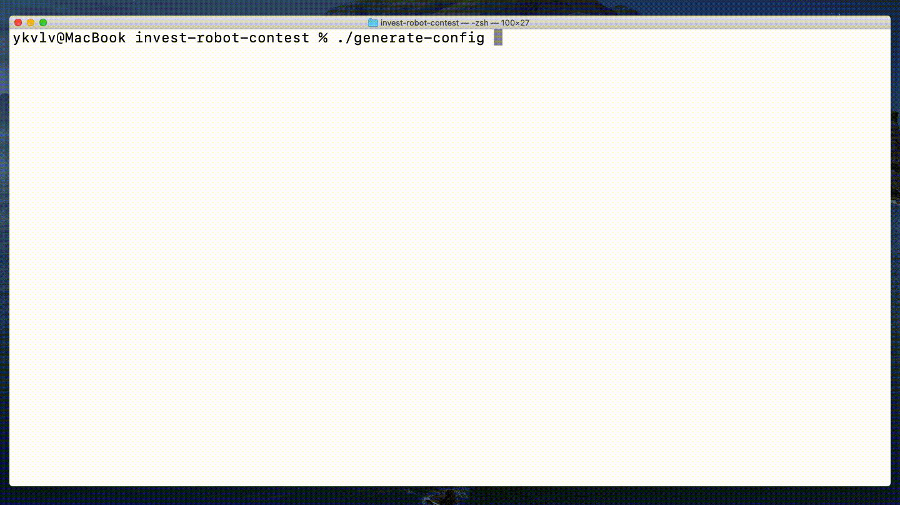
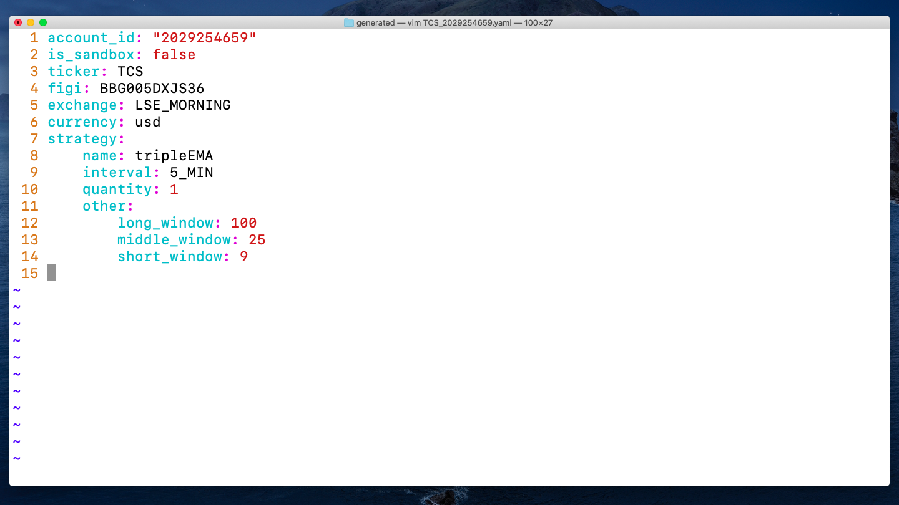
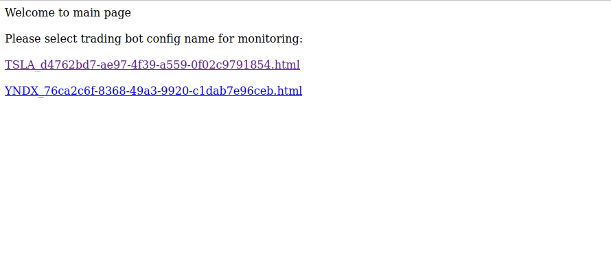
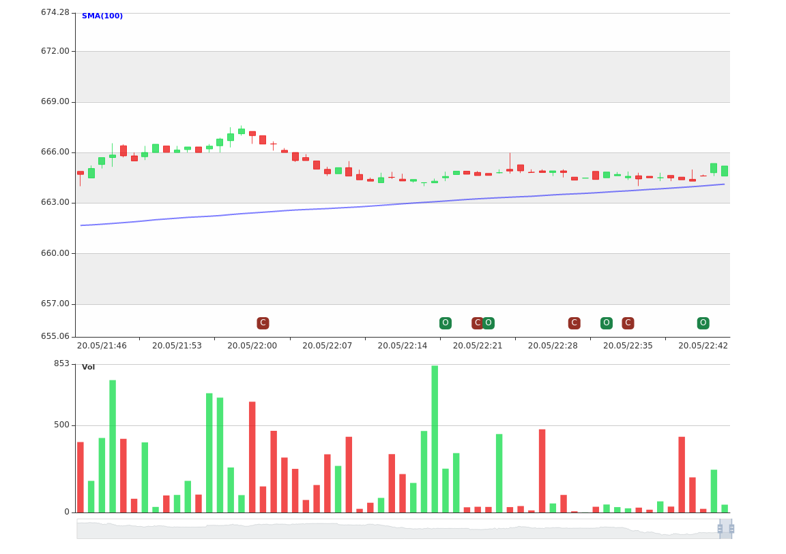

# Инвест-робот для Тинькофф-инвестиций


## Общее описание

Проект состоит из трёх бинарников: генератора конфигов `generate-config`, торгового робота `run-robot`
и утилиты для бэктестинга `strategy-backtest`.

Токен доступа передаётся через переменную окружения `TINKOFF_ACCESS_TOKEN`.

Торговый робот был запущен параллельно на 21 акции с app-name `ykvlv.invest-robot-contest` и,
исполнив 160 ордеров, доказал свою работоспособность.

Сильные стороны нашего проекта:
- Возможность добавления своих собственных торговых стратегий (сейчас релизованы 4 базовые стратегии)
- Конфигурирования стратегий (для написанных стратегий можно менять коэффициенты для каждого трейдингово конфига)
- Параллельный запуск микро-рооботов (одновременно можно торговать сразу несколькими акциями)
- Отличная визуализация торговых стратегий при помощи графиков
- Удобный генератор конфигов
- Есть логгирование всех операций на бирже, а также ошибок торгового робота

Слабые стороны проекта:
- Из-за временных ограничений не была добавлена база данных, поэтому не ведётся учёт купленных акций
- Код не покрыт юнит-тестами, также в виду временных ограничений


### Генератор конфигов для торгового робота
Позволяет сделать yaml-конфиг для торгового робота.
Позволяет указать аккаунт, акцию,
выбрать торговую стратегию и детально настроить эту торговую стратегию.

Торговый конфиг для каждой акции сохраняется в отдельный файл, и простым удалением файла-конфига или его добавлением,
можно конфигурировать торгового робота.

Генерация трейдинг конфигов:

Результатом быдет следующий файл с конфигурацией:


Сгенерированные конфиги для Sandbox аккаунта будут торговаться в песочнице, для реального - на реальной бирже.


### Торговый робот
Робот при старте читает директорию с конфигами и создаёт по самостоятельной горутине (микро-роботе) для каждого конфига.
Микро-роботы автономны и автоматически перезапускаются в случае ошибки или завершении работы алгоритма.

Микро-роботы работают параллельно, и каждый робот обслуживает свою ценную бумагу по определённой стратегии.

### Бэктестинг
После генерации конфигов или реализации новой стратегии хочется протестировать как они работают на рынке.
Для этого была создана функция бэктестинга.
После окончания работы бэктестинга будет выведена прибыль и график со свечками.

Пример работы бэктестинга:


## SDK
Был написан собственный SDK, который оборачивает gRPC-вызовы, позволяя не думать о протоколе.

В SDK реслизована механика producer-consumer,
где потребители могут подписаться на свечки инструмента (консьюмер будет оповещён о каджой новой цене инструмента).
Когда консьюмер заканчивает работу, он отписывается от оповещений.

Это решение было реализовано из-за ограничений на количество запросов,
ведь обмениваться сообщениями через двунаправленный стрим намного оптимальный,
чем отправлять кучу одиночных запросов.


## Визулизация работы алгоритма
При запуске торгового робота, также запускается небольшой вэб-сервер (по дефолту на `8080` порту).
На главной странице, по клику на имя трейдигового конфига, можно загрузить текущее состотояние
торгового микро-робота.


Тоесть в реальном времени, для каждого трейдингового конфига (т.е. каждой акции),
пока робот работает, можно смотреть на свечки и наблюдать за открытием и закрытием позиций.



После бэктестинга генерируется аналогичная `.html` страница с графиком свечек,
а также точками покупки/продажи инструмента.

## Автоматизация рутинных операций


### CI
В проекте написан CI, который автоматически запускает линтер и тесты при пулл-реквесте,
таким образам соблюдается чистота кода и его корректность.


### Makefile
Все рутинные операции автоматизированы при помощи `Makefile`.
По команде `make` будет выведен список доступных автоматизаций (команд).

Например, запуск линтера:
```shell
make lint
```
Собрать протобафы:
```shell
make compile-proto
```
Собрать бинарники:
```shell
make build
```


## Запуск проекта
Чтобы запустить проект локально, нужно всего лишь установить `Go` и `protoc`.
После этого выполнить ряд команд:
```shell
make setup
```
А потом собрать бинарники:
```shell
make build
```
Записать в переменную окружения токен доступа API:
```shell
export TINKOFF_ACCESS_TOKEN=ваш_токен_доступа
```

Теперь создайте трейдинг конфиг, запустив генератор конфигов:
```shell
./generate-config
```
Проверьте свой конфиг на исторических данных:
```shell
./strategy-backtest
```
А потом запутите товгового робота:
```shell
./strategy-backtest
```
